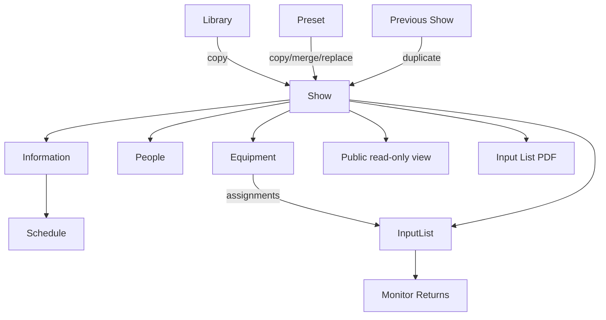

# Information architecture

## Primary editor routes

- `#/shows`
- `#/shows/:id`
- `#/library`
- `#/presets`
- `#/settings`

## Public route

- `#/public/:slug`

## Main navigation

The persistent layout contains:

- Shows;
- Library;
- Presets;
- Preferences;
- synchronization status.

## Show workspace

Each Show exposes three primary tabs:

1. Equipment
2. People
3. Information

The Input List opens as a large modal from the Show header because it is a technical working surface tied to the Show but should not replace the main workspace.

## Module relationships

## Navigation rules

- Creating a Show opens it immediately.
- Leaving a Show attempts to release its edit lock.
- A blocked Show displays the lock owner label and a retry action.
- Public routes do not render editor navigation or mutation controls.
- Unknown editor routes redirect to Shows.
