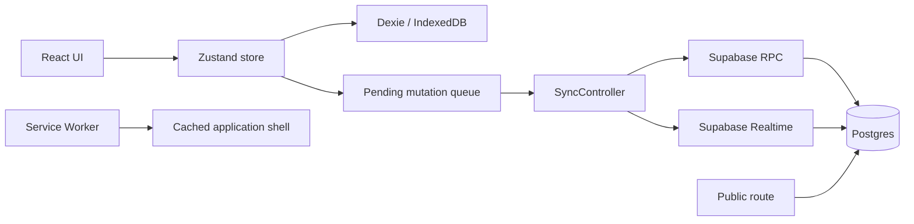

# Technical architecture

## Baseline stack

- React 18
- TypeScript 5.6
- Vite 6
- React Router with `HashRouter`
- Zustand for application state/actions
- Dexie for IndexedDB
- Supabase JS for shared storage and Realtime
- Tailwind CSS
- Lucide React icons
- jsPDF + AutoTable for Input List PDF

## Runtime topology



## Current source structure

```text
src/
  components/
    ErrorBoundary.tsx
    InputListModal.tsx
    Layout.tsx
    SyncController.tsx
    Toast.tsx
    ui.tsx
  lib/
    config.ts
    db.ts
    inputList.ts
    inputListPdf.ts
    supabase.ts
    syncQueue.ts
    useShowLock.ts
    utils.ts
  pages/
    LibraryPage.tsx
    PresetsPage.tsx
    PublicShowPage.tsx
    SettingsPage.tsx
    SetupPage.tsx
    ShowPage.tsx
    ShowsPage.tsx
  App.tsx
  index.css
  main.tsx
  store.ts
  syncStore.ts
  types.ts
```

## Architectural responsibilities

### `store.ts`

- canonical local application state;
- domain CRUD actions;
- normalization and snapshot import/export;
- local persistence scheduling;
- enqueueing shared mutations;
- applying remote rows.

### Dexie database

Stores:

- normalized application collections;
- backups;
- sync revisions;
- pending mutations.

### `SyncController`

- initial pull;
- queue processing;
- periodic sync;
- Realtime event handling;
- Show conflict modal;
- sync status.

### `useShowLock`

- acquisition;
- heartbeat;
- inactivity tracking;
- release;
- blocked/offline/idle UI state.

### Input List library

Pure functions should own:

- assignment normalization;
- generation;
- synchronization preview;
- renumbering;
- next channel/output calculation.

These functions are high-priority unit-test targets.

## Configuration

Supabase values are loaded at runtime from `public/config.js` so one static build can be configured without recompiling.

## Routing and hosting

`HashRouter` and Vite `base: './'` support GitHub Pages under repository subpaths. Avoid server rewrite requirements.

## Service Worker

The baseline caches:

- scope root;
- `index.html`;
- `config.js`;
- fetched same-origin assets.

Navigation and config use network-first with cache fallback; static assets use cache-first.

The shell cache name is explicitly release-versioned in `public/sw.js` (currently
`orion-shows-v2.0.0-m3.1`). Every deployment that changes the shell or Service Worker behavior must bump
that suffix. The installing worker fills its new cache without modifying the cache used by the active
worker; activation deletes only older `orion-shows-*` caches and preserves both the current cache and
unrelated application caches.

### Update flow (Milestone 3)

`public/sw.js` does **not** call `self.skipWaiting()` on install. A newly installed worker sits in the
`waiting` state, controlling nothing, until the app explicitly tells it to take over via
`postMessage({ type: 'SKIP_WAITING' })` — the SW's only `message` listener. This is deliberate: skipping
straight to activation would swap the cached asset set underneath a tab that may be mid-edit.

`src/lib/useServiceWorkerUpdate.ts` owns the client-side half:

- registers the worker and watches `registration.installing`/`updatefound`;
- treats a worker reaching the `installed` state as a real, user-facing update only when
  `navigator.serviceWorker.controller` already existed at that point — i.e. a previous version was already
  controlling the page. The very first install (a first-time visitor) never shows a notice;
- also checks `registration.waiting` on mount, so reopening a tab after an update finished installing in
  the background still surfaces the notice;
- polls `registration.update()` once an hour while the app stays open, since browsers otherwise only check
  for a new worker on navigation; the interval and every added listener are removed by the owning effect's
  cleanup, including React StrictMode mount/unmount cycles;
- `applyUpdate()` posts `SKIP_WAITING` to the waiting worker, then does exactly one `window.location.reload()`
  the first time `controllerchange` fires afterward (an `applyingRef` flag prevents any other
  `controllerchange` — including the very first one on a fresh install — from ever triggering a reload);
- if `controllerchange` doesn't arrive within 8 seconds of `applyUpdate()`, the update is treated as failed
  and a retry action is offered instead of leaving the UI stuck.

`src/components/UpdateNotice.tsx` renders a persistent, non-auto-dismissing `role="status"` banner
("Actualizar ahora" / "Reintentar") — mounted once near the top of `App.tsx`, regardless of Supabase
configuration — instead of a Toast, since Toasts auto-dismiss after 5 seconds and an update notice must
stay until the user acts or the tab closes.

Verified with a real build → `vite preview` → version-bump-on-disk → browser round-trip (not part of the
committed automated suite, since real SW install timing is not something a component test can exercise) and
with `tests/unit/useServiceWorkerUpdate.test.ts` (a hand-built fake `navigator.serviceWorker`, no browser SW
timing), `tests/unit/serviceWorker.test.ts` (cache isolation/cleanup and explicit activation), plus
`tests/component/UpdateNotice.test.tsx`.

## Refactoring guidance

The baseline concentrates domain actions in a large Zustand store. Refactoring is allowed only incrementally and with regression tests. Preferred direction:

- separate pure domain functions from persistence side effects;
- isolate repository interfaces;
- keep UI hooks thin;
- avoid a full rewrite.

## Performance targets

- first usable render on a normal broadband connection within a few seconds;
- local mutations feel immediate;
- lists of at least 200 equipment rows remain usable;
- Input List PDF generation completes without freezing indefinitely;
- code-split heavy PDF dependencies so they do not dominate initial bundle.
