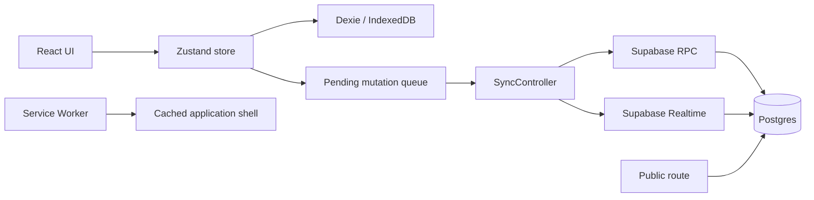

# Technical architecture

## Baseline stack

- React 18
- TypeScript 5.6
- Vite 6
- React Router with `HashRouter`
- Zustand for application state/actions
- Dexie for IndexedDB
- Supabase JS for shared storage and Realtime
- Tailwind CSS
- Lucide React icons
- jsPDF + AutoTable for Input List PDF

## Runtime topology



## Current source structure

```text
src/
  components/
    ErrorBoundary.tsx
    InputListModal.tsx
    Layout.tsx
    SyncController.tsx
    Toast.tsx
    ui.tsx
  lib/
    config.ts
    db.ts
    inputList.ts
    inputListPdf.ts
    supabase.ts
    syncQueue.ts
    useShowLock.ts
    utils.ts
  pages/
    LibraryPage.tsx
    PresetsPage.tsx
    PublicShowPage.tsx
    SettingsPage.tsx
    SetupPage.tsx
    ShowPage.tsx
    ShowsPage.tsx
  App.tsx
  index.css
  main.tsx
  store.ts
  syncStore.ts
  types.ts
```

## Architectural responsibilities

### `store.ts`

- canonical local application state;
- domain CRUD actions;
- normalization and snapshot import/export;
- local persistence scheduling;
- enqueueing shared mutations;
- applying remote rows.

### Dexie database

Stores:

- normalized application collections;
- backups;
- sync revisions;
- pending mutations.

### `SyncController`

- initial pull;
- queue processing;
- periodic sync;
- Realtime event handling;
- Show conflict modal;
- sync status.

### `useShowLock`

- acquisition;
- heartbeat;
- inactivity tracking;
- release;
- blocked/offline/idle UI state.

### Input List library

Pure functions should own:

- assignment normalization;
- generation;
- synchronization preview;
- renumbering;
- next channel/output calculation.

These functions are high-priority unit-test targets.

## Configuration

Supabase values are loaded at runtime from `public/config.js` so one static build can be configured without recompiling.

## Routing and hosting

`HashRouter` and Vite `base: './'` support GitHub Pages under repository subpaths. Avoid server rewrite requirements.

## Service Worker

The baseline caches:

- scope root;
- `index.html`;
- `config.js`;
- fetched same-origin assets.

Navigation and config use network-first with cache fallback; static assets use cache-first.

## Refactoring guidance

The baseline concentrates domain actions in a large Zustand store. Refactoring is allowed only incrementally and with regression tests. Preferred direction:

- separate pure domain functions from persistence side effects;
- isolate repository interfaces;
- keep UI hooks thin;
- avoid a full rewrite.

## Performance targets

- first usable render on a normal broadband connection within a few seconds;
- local mutations feel immediate;
- lists of at least 200 equipment rows remain usable;
- Input List PDF generation completes without freezing indefinitely;
- code-split heavy PDF dependencies so they do not dominate initial bundle.
